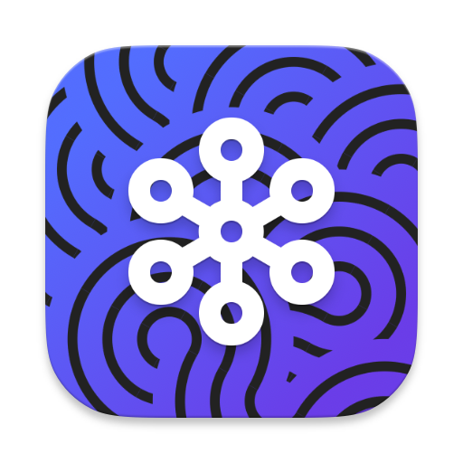
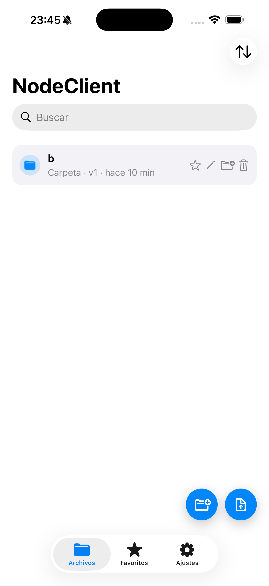
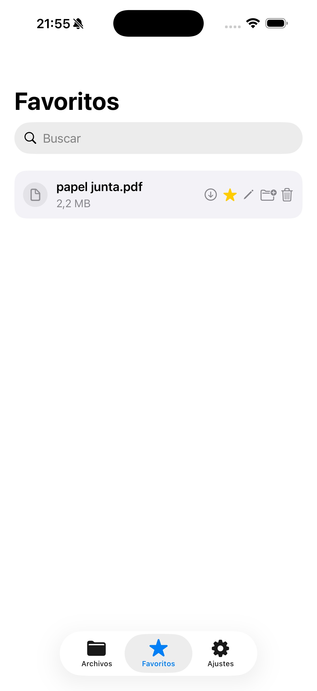
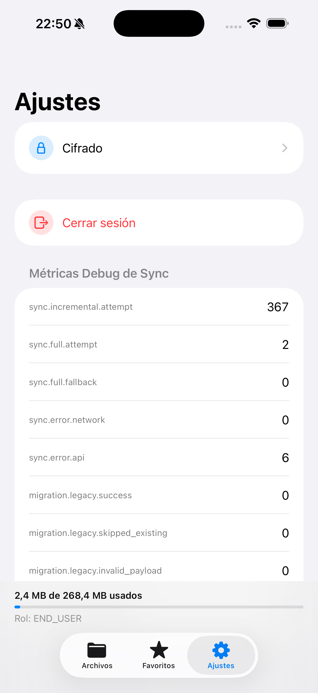
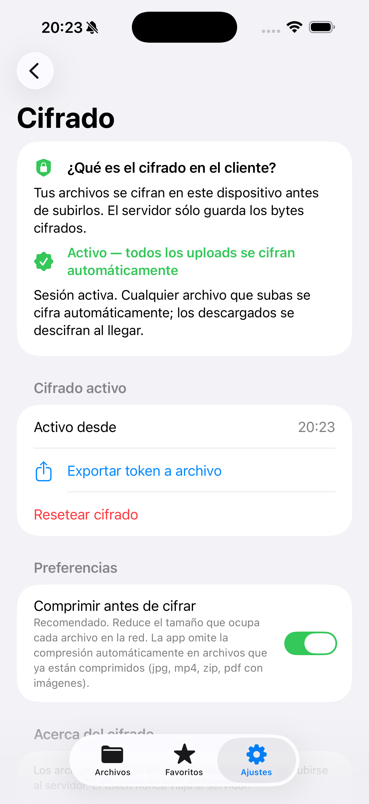
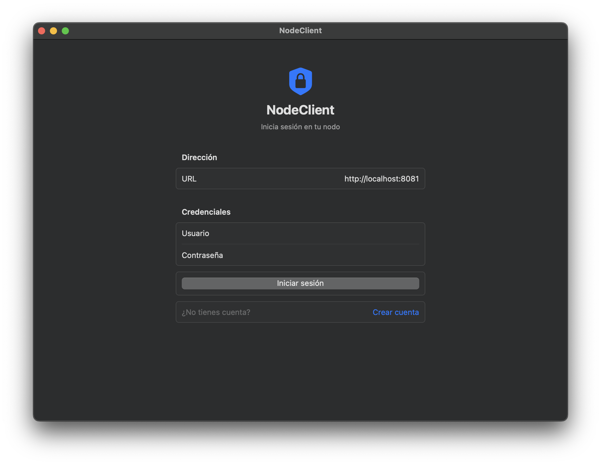
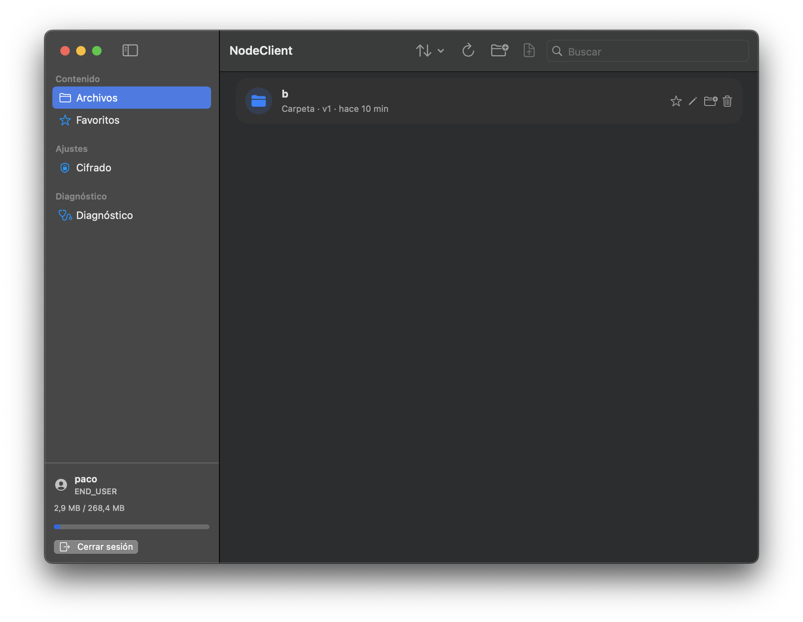
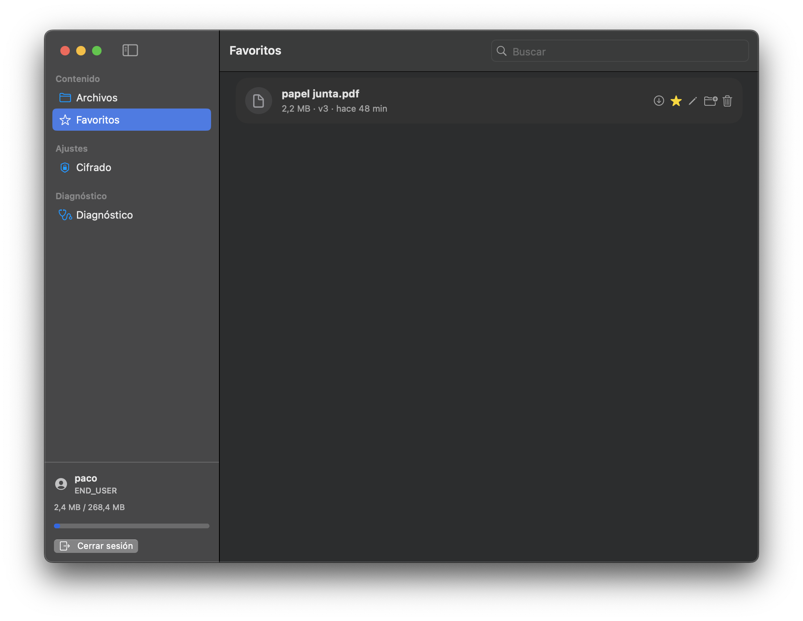
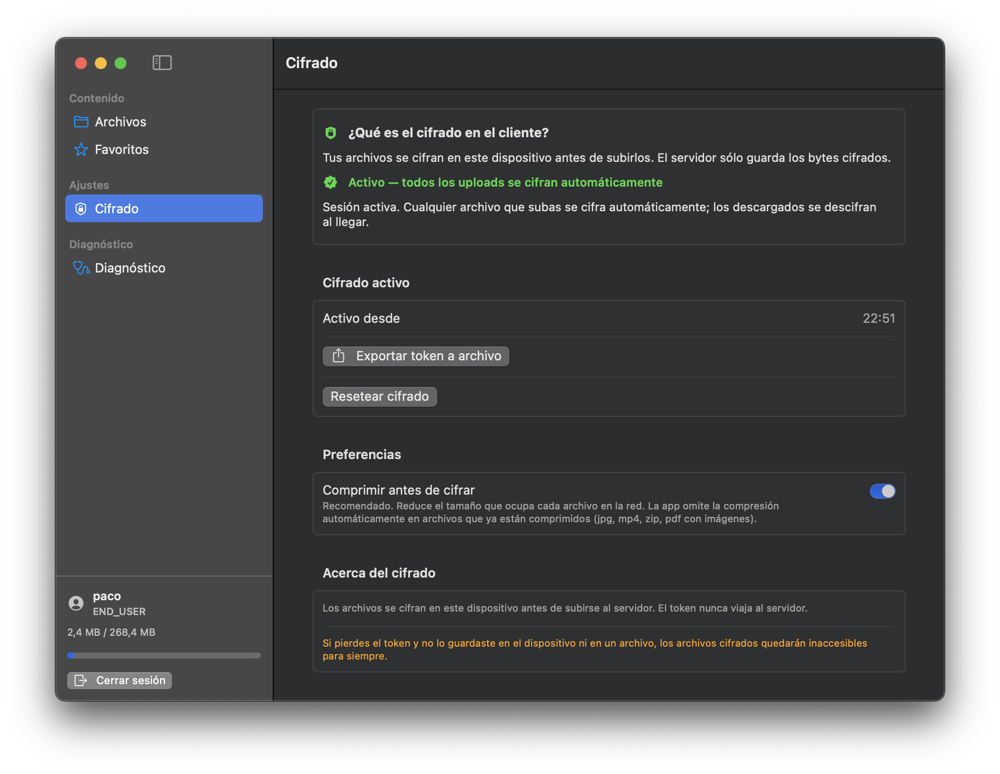

# NodeClient

### Cliente SwiftUI multiplataforma (iOS y macOS) para el backend de almacenamiento distribuido [Node](https://github.com/jpg486-ual/Node)

<!-- Badges CI (GitHub Actions) -->

<!-- Screenshots iPhone-->
#### iPhone (iOS)

  
  
  
  

<!-- Screenshots Mac-->
#### macOS

  
  

  
  

---